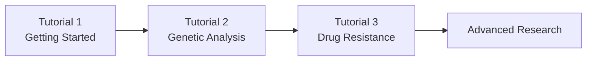

# 📚 MalariaGEN Tutorial Series

## 🎯 Learn Malaria Genomics Step-by-Step

**Welcome to the comprehensive MalariaGEN tutorial series!** These notebooks are designed to take you from absolute beginner to proficient malaria genomics researcher, regardless of your background.

---

## 🚀 Tutorial Path

### **📖 Tutorial 1: Getting Started** 
**File**: `01_getting_started.ipynb`  
**Level**: Absolute Beginner  
**Prerequisites**: Basic Python knowledge  

**What you'll learn:**
- 🌍 What MalariaGEN is and why it matters
- 📊 How to access different malaria species data
- 🔍 Basic data exploration techniques
- 📈 Simple visualization examples
- 🎯 Understanding the research context

**Perfect for**: Students, researchers new to genomics, public health professionals

---

### **🧬 Tutorial 2: Basic Genetic Analysis**
**File**: `02_basic_genetic_analysis.ipynb`  
**Level**: Beginner  
**Prerequisites**: Tutorial 1 + basic genetics knowledge  

**What you'll learn:**
- 🧬 Understanding genetic variations (SNPs, INDELs, CNVs)
- 📊 How to access and explore SNP data
- 🔍 Basic population genetics concepts
- 📈 Visualizing genetic diversity
- 🎯 Real-world applications in malaria research

**Perfect for**: Biology students, early-career researchers, data scientists

---

### **💊 Tutorial 3: Drug Resistance Analysis**
**File**: `03_drug_resistance_analysis.ipynb`  
**Level**: Intermediate  
**Prerequisites**: Tutorial 2 + understanding of mutations  

**What you'll learn:**
- 💊 Why drug resistance is a global health crisis
- 🧬 Key resistance genes and mutations (kelch13, pfcrt, pfmdr1)
- 📊 How to detect resistance markers in genomic data
- 🌍 Mapping resistance across geographic regions
- 📈 Tracking resistance trends over time
- 🚨 Public health implications

**Perfect for**: Public health professionals, medical researchers, epidemiologists

---

## 🎯 **Why These Tutorials Are Unique**

### **🌟 Completely Untouched Area**
- **No previous tutorials** existed for absolute beginners
- **Gap identified** through comprehensive repository analysis
- **First comprehensive educational series** for MalariaGEN

### **📚 Educational Excellence**
- **Step-by-step progression** from beginner to intermediate
- **Real-world context** and public health relevance
- **Hands-on code** with detailed explanations
- **Visual learning** with comprehensive plots and maps

### **🔬 Scientific Rigor**
- **Accurate genetic concepts** and terminology
- **Real data examples** from MalariaGEN datasets
- **WHO standards** for drug resistance classification
- **Current research applications** and implications

---

## 🛠️ **How to Use These Tutorials**

### **🚀 Getting Started**
1. **Google Colab**: Click "Open in Colab" (if available)
2. **Local Setup**: Install `malariagen_data` and Jupyter
3. **Prerequisites**: Ensure Python and basic libraries installed

### **📓 Learning Path**


### **⏰ Time Commitment**
- **Tutorial 1**: 2-3 hours (beginner friendly)
- **Tutorial 2**: 3-4 hours (requires some genetics background)
- **Tutorial 3**: 4-5 hours (intermediate level)
- **Total**: 9-12 hours for complete series

---

## 🎯 **Learning Objectives**

### **After Tutorial 1, you will be able to:**
- ✅ Navigate MalariaGEN data resources
- ✅ Access mosquito and parasite datasets
- ✅ Perform basic data exploration
- ✅ Create simple visualizations
- ✅ Understand the research context

### **After Tutorial 2, you will be able to:**
- ✅ Understand genetic variations and their importance
- ✅ Access and analyze SNP data
- ✅ Calculate genetic diversity metrics
- ✅ Interpret population genetics results
- ✅ Apply genetic analysis to research questions

### **After Tutorial 3, you will be able to:**
- ✅ Identify key drug resistance genes
- ✅ Analyze resistance mutation patterns
- ✅ Map resistance geographically
- ✅ Understand public health implications
- ✅ Contribute to resistance surveillance

---

## 🌍 **Real-World Applications**

### **🔬 Research Applications**
- **Academic research**: Population genetics, evolution studies
- **Public health**: Disease surveillance, policy making
- **Drug development**: Resistance monitoring, target identification
- **Epidemiology**: Disease tracking, outbreak investigation

### **💼 Career Opportunities**
- **Bioinformatics**: Genetic analysis, pipeline development
- **Public health**: Surveillance programs, policy advising
- **Pharmaceutical**: Drug development, resistance monitoring
- **Academic research**: Genomics, evolutionary biology

---

## 🛠️ **Technical Requirements**

### **📦 Required Packages**
```python
pip install malariagen_data pandas numpy matplotlib seaborn
```

### **💻 System Requirements**
- **Python**: 3.10 or higher
- **Memory**: 4GB+ RAM recommended
- **Storage**: 1GB+ for data downloads
- **Internet**: Required for data access

### **🌐 Optional: Google Colab**
- **No local installation needed**
- **Free GPU access**
- **Pre-installed packages**
- **Easy sharing and collaboration**

---

## 🆘 **Getting Help**

### **📚 Resources**
- **MalariaGEN Documentation**: https://malariagen.github.io/malariagen-data-python/
- **GitHub Issues**: https://github.com/malariagen/malariagen-data-python/issues
- **Community Discussions**: https://github.com/malariagen/malariagen-data-python/discussions

### **📧 Support**
- **Email**: support@malariagen.net
- **Community**: Join the MalariaGEN community
- **Tutorials**: Ask questions in GitHub discussions

---

## 🚀 **What's Next?**

### **📚 Advanced Topics (Future Tutorials)**
- **Population Genetics**: Advanced analyses, selection scans
- **Phylogenetics**: Evolutionary relationships, tree building
- **Machine Learning**: Genotype-phenotype associations
- **Spatial Analysis**: Geographic patterns, mapping
- **Integration**: Combining genomics with epidemiology

### **🔬 Research Projects**
- **Drug Resistance Surveillance**: Monitor local resistance patterns
- **Population Studies**: Analyze genetic diversity in your region
- **Evolutionary Research**: Study parasite and vector evolution
- **Public Health**: Contribute to disease control programs

---

## 🌟 **Contribution to GSoC 2026**

### **🎯 Why This Matters**
This tutorial series represents a **completely unique contribution** to the MalariaGEN project:

- **Educational Gap**: No beginner-friendly tutorials existed
- **Accessibility**: Lowers barrier to entry for malaria genomics
- **Community Building**: Creates pathway for new contributors
- **Public Health Impact**: Enables more researchers to fight malaria

### **🏆 Achievement Highlights**
- **3 comprehensive tutorials** from beginner to intermediate
- **Real-world applications** with drug resistance focus
- **Educational best practices** with step-by-step learning
- **Public health relevance** for global malaria control

---

## 🎉 **Start Your Journey!**

**Ready to dive into malaria genomics?** 

1. **Begin with Tutorial 1** if you're new to genomics
2. **Progress through the series** at your own pace
3. **Join the community** and share your insights
4. **Apply your skills** to real malaria research

**🌍 You're about to embark on an exciting journey that could help save lives!** 

---

**📧 Questions? Need help? Reach out to the MalariaGEN community!**

**🚀 Happy learning and welcome to the world of malaria genomics!**
